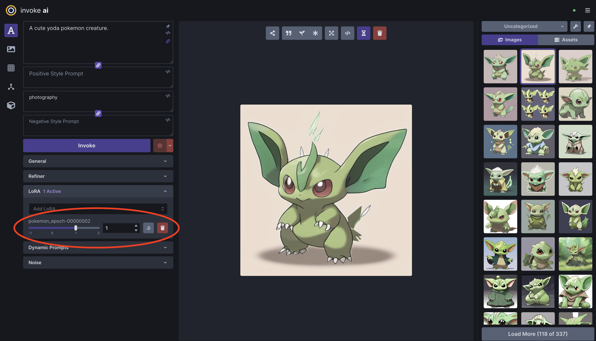

# Quick Start

This page walks through the steps to train your first model with `invoke-training`.

This tutorial explains how to train a basic Pokemon Style LoRA using the [lambdalabs/pokemon-blip-captions](https://huggingface.co/datasets/lambdalabs/pokemon-blip-captions) dataset on the [Stable Diffusion v1.5](https://huggingface.co/runwayml/stable-diffusion-v1-5) base model, and how to use it in [InvokeAI](https://github.com/invoke-ai/InvokeAI).

This training process has been tested on an NVIDIA GPU with 8GB of VRAM.


## Tutorial

### 1. Installation
Follow the [`invoke-training` installation instructions](./installation.md).

### 2. Config file
We will use the [configs/finetune_lora_sd_pokemon_1x8gb_example.yaml](https://github.com/invoke-ai/invoke-training/blob/main/configs/finetune_lora_sd_pokemon_1x8gb_example.yaml) (SD v1.5, 8GB VRAM) configuration file for this tutorial. This configuration file controls all of the parameters of the training process and has been pre-configured for this tutorial. If you're curious, you can learn more about the configuration file format in the [full pipeline tutorials](../tutorials/index.md) or the [configuration reference](../reference/config/index.md) docs.

### 3. Start training!
Start the training pipeline:
```bash
invoke-train --cfg-file configs/finetune_lora_sd_pokemon_1x8gb_example.yaml
```

### 4. Monitor training
Monitor the training process with Tensorboard by running `tensorboard --logdir output/` and visiting [localhost:6006](http://localhost:6006) in your browser. Here you can see generated images for fixed validation prompts throughout the training process.


*Validation images in the Tensorboard UI.*

### 5. InvokeAI
Select a checkpoint based on the quality of the generated images. In this short training run, there are only 3 checkpoints to choose from. As an example, we'll use the **Epoch 2** checkpoint.

If you haven't already, setup [InvokeAI](https://github.com/invoke-ai/InvokeAI) by following its documentation.

Copy your selected LoRA checkpoint into your `${INVOKEAI_ROOT}/autoimport/lora` directory. For example:
```bash
# Note: You will have to replace the timestamp in the checkpoint path.
cp output/1691088769.5694647/checkpoint_epoch-00000002.safetensors ${INVOKEAI_ROOT}/autoimport/lora/pokemon_epoch-00000002.safetensors
```

You can now use your trained Pokemon LoRA in the InvokeAI UI! 🎉


*Example image generated with the prompt "A cute yoda pokemon creature." and Pokemon LoRA.*

## Next Steps

After completing this Quick Start tutorial, we recommend continuing with any of the [full training pipeline tutorials](../tutorials/index.md).
