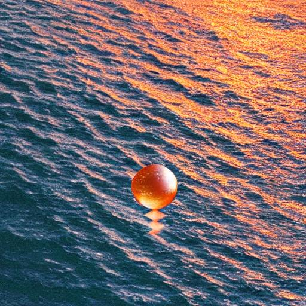
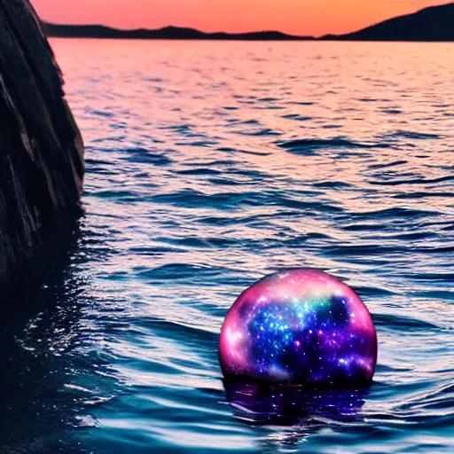

# (Experimental) Diffusion DPO - SD

!!! tip "Experimental"
    The Diffusion Direct Preference Optimization training pipeline is still experimental. Support may be dropped at any time.

This tutorial walks through some initial experiments around using Diffusion Direct Preference Optimization (DPO) ([paper](https://arxiv.org/abs/2311.12908)) to train Stable Diffusion LoRA models.


## Experiment 1: `pickapic_v2` LoRA Training

The Diffusion-DPO paper does full model fine-tuning on the [pickapic_v2](https://huggingface.co/datasets/yuvalkirstain/pickapic_v2) dataset, which consists of roughly 1M AI-generated image pairs with preference annotations. In this experiment, we attempt to fine-tune a Stable Diffusion LoRA model using a small subset of the pickapic_v2 dataset.

Run this experiment with the following command:
```bash
invoke-train -c configs/_experimental/dpo_lora_sd_pickapic_1x24gb_example.yaml
```

Here is a cherry-picked example of a prompt for which this training process was clearly beneficial.
Prompt: "*A galaxy-colored figurine is floating over the sea at sunset, photorealistic*"

| Before DPO Training | After DPO Training (same seed)|
| - | - |
|  |  |

## Experiment 2: LoRA Model Refinement

As a second experiment, we attempt the following workflow:

1. Train a Stable Diffusion LoRA model on a particular style.
2. Generate pairs of images of the character with the trained LoRA model.
3. Annotate the preferred image from each pair.
4. Apply Diffusion-DPO to the preference-annotated pairs to further fine-tune the LoRA model.

Note: The steps listed below are pretty rough. They are included primarily for reference for someone looking to resume this line of work in the future.

### 1. Train a style LoRA

```bash
invoke-train -c configs/_experimental/finetune_lora_sd_pokemon_1x8gb_example.yaml
```

### 2. Generate images

Prepare ~100 relevant prompts that will be used to generate training data with the freshly-trained LoRA model. Add the prompts to a `.txt` file - one prompt per line.

Example prompts:
```txt
a cute orange pokemon character with pointy ears
a drawing of a purple fish
a cartoon blob with a smile on its face
a drawing of a snail with big eyes
...
```

```bash
# Convert the LoRA checkpoint of interest to Kohya format.
# You will have to change the path timestamps in this example command.
# TODO(ryand): This manual conversion shouldn't be necessary.
python src/invoke_training/scripts/convert_sd_lora_to_kohya_format.py \
  --src-ckpt-dir output/finetune_lora_sd_pokemon/1704824279.2765746/checkpoint_epoch-00000003/ \
  --dst-ckpt-file output/finetune_lora_sd_pokemon/1704824279.2765746/checkpoint_epoch-00000003_kohya.safetensors

# Generate 2 pairs of images for each prompt.
invoke-generate-images \
  -o output/pokemon_pairs \
  -m runwayml/stable-diffusion-v1-5 \
  -v fp16 \
  -l output/finetune_lora_sd_pokemon/1704824279.2765746/checkpoint_epoch-00000003_kohya.safetensors \
  --sd-version SD \
  --prompt-file path/to/prompts.txt \
  --set-size 2 \
  --num-sets 2 \
  --height 512 \
  --width 512
```

### 3. Annotate the image pair preferences

Launch the gradio UI for selecting image pair preferences.

```bash
# Note: rank_images.py accepts a full training pipeline config, but only uses the dataset configuration.
python src/invoke_training/scripts/_experimental/rank_images.py -c configs/_experimental/dpo_lora_refinement_sd_pokemon_1x24gb_example.yaml
```

After completing the pair annotations, click "Save Metadata" and move the resultant metadata file to your image data directory (e.g. `output/pokemon_pairs/metadata.jsonl`).

### 4. Run Diffusion-DPO

```bash
invoke-train -c configs/_experimental/dpo_lora_refinement_sd_pokemon_1x24gb_example.yaml
```