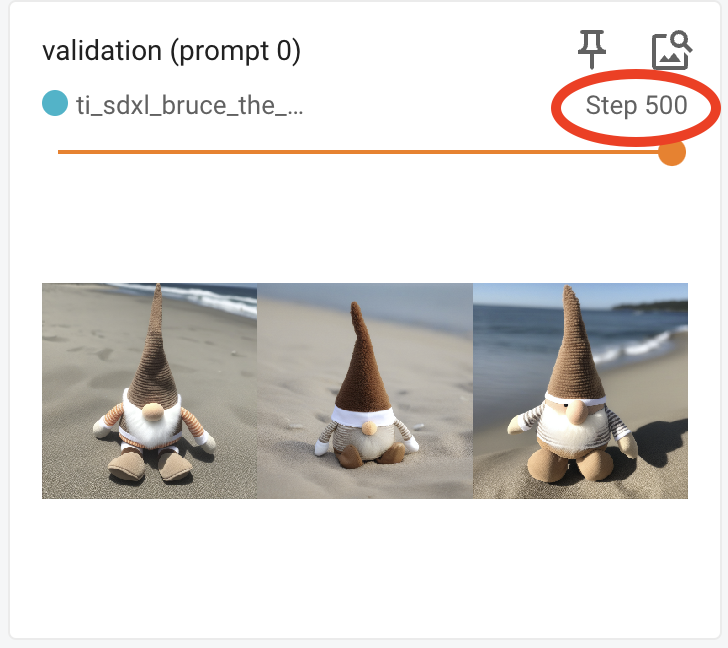

# Textual Inversion - SDXL

This tutorial walks through a [Textual Inversion](https://arxiv.org/abs/2208.01618) training run with a [Stable Diffusion XL](https://huggingface.co/stabilityai/stable-diffusion-xl-base-1.0) base model.

## 1 - Dataset

For this tutorial, we'll use a dataset consisting of 4 images of Bruce the Gnome:

| | |
| - | - |
|  |  |
|  |  |

This sample dataset is included in the invoke-training repo under [sample_data/bruce_the_gnome](https://github.com/invoke-ai/invoke-training/tree/main/sample_data/bruce_the_gnome).

Here are a few tips for preparing a Textual Inversion dataset:

- Aim for 4 to 50 images of your concept (object / style). The optimal number depends on many factors, and can be much higher than this for some use cases.
- Vary all of the image features that you *don't* want your TI embedding to contain (e.g. background, pose, lighting, etc.).

## 2 - Configuration

Below is the training configuration that we'll use for this tutorial.

Raw config file: [configs/sdxl_textual_inversion_gnome_1x24gb.yaml](https://github.com/invoke-ai/invoke-training/blob/main/configs/sdxl_textual_inversion_gnome_1x24gb.yaml).

Full config reference docs: [Textual Inversion SDXL Config](../../reference/config/pipelines/sdxl_textual_inversion.md)

```yaml title="sdxl_textual_inversion_gnome_1x24gb.yaml"
--8<-- "configs/sdxl_textual_inversion_gnome_1x24gb.yaml"
```

## 3 - Start Training

[Install invoke-training](../../get_started/installation.md), if you haven't already.

Launch the Textual Inversion training pipeline:
```bash
# From inside the invoke-training/ source directory:
invoke-train -c configs/sdxl_textual_inversion_gnome_1x24gb.yaml
```

Training takes ~40 mins on an NVIDIA RTX 4090.

## 4 - Monitor

In a new terminal, launch Tensorboard to monitor the training run:
```bash
tensorboard --logdir output/
```
Access Tensorboard at [localhost:6006](http://localhost:6006) in your browser.

Sample images will be logged to Tensorboard so that you can see how the Textual Inversion embedding is evolving.

Once training is complete, select the epoch that produces the best visual results.

For this tutorial, we'll choose epoch 500:

*Screenshot of the Tensorboard UI showing the validation images for epoch 500.*

## 5 - Transfer to InvokeAI

If you haven't already, setup [InvokeAI](https://github.com/invoke-ai/InvokeAI) by following its documentation.

Copy the selected TI embedding into your `${INVOKEAI_ROOT}/autoimport/embedding/` directory. For example:
```bash
cp output/ti_sdxl_bruce_the_gnome/1702587511.2273068/checkpoint_epoch-00000500.safetensors ${INVOKEAI_ROOT}/autoimport/embedding/bruce_the_gnome.safetensors
```

Note that we renamed the file to `bruce_the_gnome.safetensors`. You can choose any file name, but this will become the token used to reference your embedding. So, in our case, we can refer to our new embedding by including `<bruce_the_gnome>` in our prompts.

Launch Invoke AI and you can now use your new `bruce_the_gnome` TI embedding! 🎉


*Example image generated with the prompt "`a photo of <bruce_the_gnome> at the park`".*
